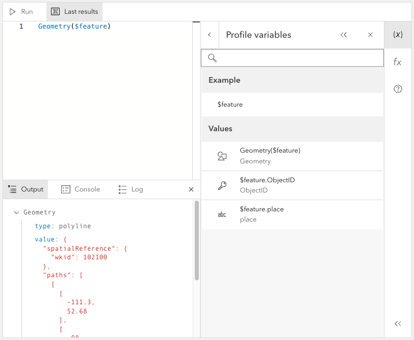
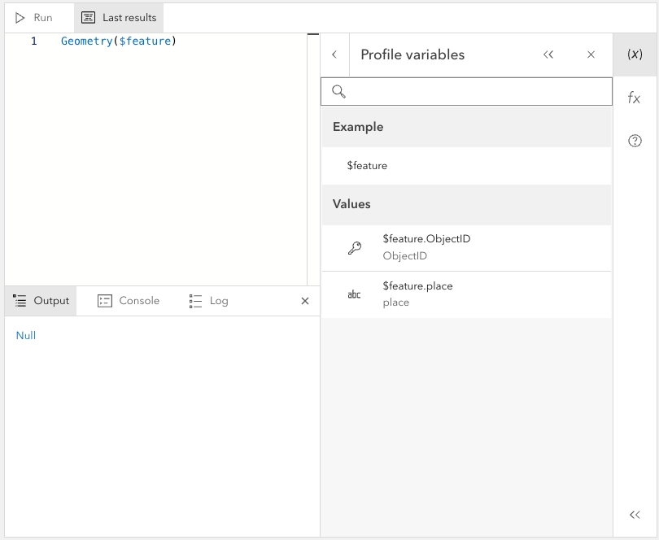

# Client-side graphics demo

This demo shows you how to set up an Arcade editor using only client-side graphics. This means we are not loading data from AGOL.

## Arcade editor with client-side graphics containing geography

```js
const polylineGraphic = new Graphic({
  attributes: {
    place: "home",
    ObjectID: 5,
  },
  geometry: {
    type: "polyline",
    paths: [
      [-111.3, 52.68],
      [-98, 49.5],
      [-93.94, 29.89],
    ],
    spatialReference: { wkid: 4326 },
  },
});

const polylineFeature = new FeatureLayer({
  source: [polylineGraphic],
  title: "Example",
  fields: [
    {
      name: "ObjectID",
      alias: "ObjectID",
      type: "oid",
    },
    {
      name: "place",
      alias: "place",
      type: "string",
    },
  ],
  objectIdField: "ObjectID",
  geometryType: "polyline",
});

arcadeEditorElt.profile = {
  id: "popup",
  disabledVariables: ["$layer", "$map", "$datastore"],
  definitions: {
    $feature: polylineFeature,
  },
};

arcadeEditorElt.testData = {
  profileVariableInstances: {
    $feature: polylineGraphic,
  },
  spatialReference: polylineGraphic.geometry.spatialReference,
};
```



## Arcade editor with client-side graphics not containing geography

If you plan to use features that do not have geometry, you can write the following:

```js
const polylineGraphic = new Graphic({
  attributes: {
    place: "home",
    ObjectID: 5,
  },
});

const polylineFeature = new FeatureLayer({
  source: [],
  title: "Example",
  fields: [
    {
      name: "ObjectID",
      alias: "ObjectID",
      type: "oid",
    },
    {
      name: "place",
      alias: "place",
      type: "string",
    },
  ],
  objectIdField: "ObjectID",
});

arcadeEditorElt.profile = {
  id: "popup",
  disabledVariables: ["$layer", "$map", "$datastore"],
  definitions: {
    $feature: polylineFeature,
  },
};

arcadeEditorElt.testData = {
  profileVariableInstances: {
    $feature: polylineGraphic,
  },
  spatialReference: {
    wkid: 3857,
  },
};
```



## Resources

[Esri Graphic](https://developers.arcgis.com/javascript/latest/api-reference/esri-Graphic.html)

[Esri FeatureLayer](https://developers.arcgis.com/javascript/latest/api-reference/esri-layers-FeatureLayer.html)
